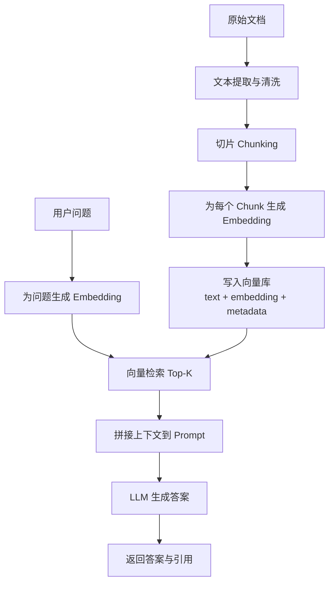

# RAG 学习计划

## 适用范围

- 当前阶段目标：先把 `RAG` 的完整链路学清楚，再考虑接入 Pinecone、LangChain 或正式项目
- 当前关注重点：`切片 -> embedding -> 检索 -> 拼接上下文 -> 回答`
- 当前学习方式：先理解概念和数据流，再做最小实验，不急着一上来堆框架

## 今天学完后，你应该达到的结果

- 你能用自己的话解释什么是 `RAG`
- 你能画出一条完整的 `RAG` 数据流
- 你知道 `chunk size`、`overlap`、`top-k`、`metadata` 分别影响什么
- 你知道为什么 `RAG` 能减少“瞎编”，但又不能彻底消除幻觉
- 你能判断一个回答质量差，到底是“检索没找对”还是“生成没用好”

## 先用一句话理解

`RAG` 不是“让模型凭空知道更多”，而是“先从外部知识里找相关材料，再把材料连同问题一起交给模型回答”。

## RAG 为什么有效

你可以先记住最核心的 4 点：

- 大模型参数里装的是“压缩后的统计知识”，不是你项目里的最新资料
- 用户问问题时，真正相关的信息通常只占所有知识里的很小一部分
- 先检索再回答，能把模型注意力集中到“当前问题最相关”的片段上
- 回答时给出来源片段，模型更容易基于证据作答，而不是只靠参数记忆补全

换句话说，`RAG` 的价值不在于“让模型更聪明”，而在于“让模型在回答这次问题时，看到更相关、更新、更可控的上下文”。

## 先建立一个最小心智模型

把 `RAG` 理解成下面这条链路：

1. 你先准备一批文档
2. 把文档切成很多小块 `chunks`
3. 把每个 `chunk` 转成向量，也就是 `embedding`
4. 用户提问时，把问题也转成向量
5. 去向量库里找最相近的几个 `chunks`
6. 把这些片段拼进 prompt
7. 模型基于“问题 + 检索结果”生成答案

一句话版：

“先找资料，再带着资料回答。”

## RAG 全流程拆解

### 1. 文档切片 `chunking`

原始文档通常太长，不能整篇直接塞进上下文，所以要先切成多个片段。

切片的目标不是“平均切开”，而是：

- 每一片都尽量语义完整
- 每一片都不要太长，方便检索和拼接
- 相邻片段之间保留一点上下文连续性

如果你把一段定义切一半、例子切一半、结论切一半，后面检索回来时就很可能不完整。

### 2. 向量化 `embedding`

`embedding` 可以理解成“把一句话映射到向量空间里”，让“语义相近”的文本在空间里靠得更近。

例如：

- “退款政策是什么”
- “怎么申请退款”
- “退货之后多久返钱”

这几句文字表面不同，但语义接近，向量距离通常也会接近。

因此，向量检索找的不是关键词完全一致，而是“意思相近”。

### 3. 建库 / 入库 `indexing`

每个 `chunk` 在入库时，通常不只存正文，还会一起存：

- `id`
- `text`
- `embedding`
- `metadata`

这里的 `metadata` 很重要，因为后面你往往要知道：

- 这个片段来自哪个文件
- 来自第几页
- 属于哪个章节
- 是否属于某个用户、租户、知识库

所以向量库里存的不是“裸文本”，而是“文本 + 向量 + 可追踪信息”。

### 4. 查询检索 `retrieval`

当用户提问时，系统会：

1. 先把问题也转成 `embedding`
2. 用问题向量去搜索最相近的 `chunks`
3. 取回前 `top-k` 个片段

这一步是 `RAG` 成败最关键的地方之一。

因为如果“找回来的资料就不对”，后面的模型再强，也只能“拿错材料认真回答”。

### 5. 上下文拼接 `augmentation`

拿到检索结果后，不是直接把它们扔给用户，而是先拼到 prompt 里，常见结构是：

```txt
你是一个问答助手，请严格依据提供的资料回答。

资料 1:
...

资料 2:
...

用户问题:
...
```

这一步的目标是让模型明确知道：

- 哪些内容是证据
- 用户真正的问题是什么
- 回答时要不要引用来源
- 如果资料不足，应不应该拒答

### 6. 生成回答 `generation`

最后模型会基于“用户问题 + 检索到的上下文”生成答案。

注意这里模型仍然在“生成”，所以：

- 它可能忠实利用检索内容
- 也可能误读上下文
- 也可能把上下文和参数记忆混在一起

所以 `RAG` 不是把生成变成数据库查询，而是“用检索结果约束生成”。

## 你必须理解的 4 个核心参数

### 1. `chunk size`

`chunk size` 是每个文本片段的长度。

你可以把它理解成：一次切多少内容当作一个检索单元。

太小的问题：

- 信息不完整
- 一段定义和它的解释可能被拆开
- 检索回来后上下文碎片化严重

太大的问题：

- 一个 chunk 里混了太多主题
- 检索命中后会带回很多无关信息
- 浪费上下文窗口

直觉上：

- 知识点密集、定义明确的文档，`chunk size` 可以小一些
- 叙述性强、上下文依赖强的文档，`chunk size` 可以大一些

### 2. `overlap`

`overlap` 是相邻两个 `chunk` 的重叠部分长度。

它的作用是避免“关键信息刚好被切断”。

例如一段话跨越两个 chunk：

- 没有 overlap 时，前一块丢后半句，后一块丢前半句
- 有 overlap 时，两边都会带上一部分上下文

太小的问题：

- 语义衔接容易断

太大的问题：

- 重复内容太多
- 入库量增加
- 检索结果容易返回高度重复的片段

### 3. `top-k`

`top-k` 表示一次检索取回前几个最相似的片段。

太小的问题：

- 可能漏掉关键背景
- 问题稍复杂时证据不足

太大的问题：

- 把很多边缘相关内容也塞进 prompt
- 干扰模型聚焦
- 增加 token 成本

可以先用一个很朴素的判断：

- 简单事实问答，`top-k` 可以小一点
- 需要综合多个证据的问题，`top-k` 往往要大一点

### 4. `metadata`

`metadata` 是每个片段的附加信息。

它至少解决 3 类问题：

- 可追溯：回答后能告诉用户“这段内容来自哪里”
- 可过滤：只搜某个文档、某个用户、某个时间范围
- 可调试：你能知道检索回来的是哪一页、哪一段

没有 `metadata` 的 RAG，常常会出现两个问题：

- 你不知道答案依据了哪份文档
- 你调试时看不出“检索错了”还是“模型用错了”

## RAG 数据流

### ASCII 版

```txt
原始文档
   |
   v
文本提取 / 清洗
   |
   v
切片 chunking
   |
   v
为每个 chunk 生成 embedding
   |
   v
写入向量库 (text + embedding + metadata)


用户问题
   |
   v
为问题生成 embedding
   |
   v
去向量库检索 top-k 个相关 chunks
   |
   v
拼接上下文到 prompt
   |
   v
LLM 生成答案
   |
   v
返回答案 + 引用来源
```

### Mermaid 版



## 为什么 RAG 不等于“不会幻觉”

这是非常容易误解的一点。

`RAG` 只能降低一部分幻觉，不能保证完全正确，因为风险至少来自 4 个地方：

- 检索没找对：根本没找到真正相关的片段
- 切片不好：答案被切碎了，召回的是不完整证据
- 拼接不好：上下文太乱，模型抓不到重点
- 生成失真：模型读到了证据，但总结时还是说偏了

所以你调试 RAG 时，思路不能只停留在“模型怎么又答错了”，而要问：

- 找回来的是不是对的
- 找回来的是不是完整的
- prompt 有没有清楚要求“严格依据资料回答”

## 推荐学习顺序

### 模块 1：先把链路背下来，不急着写代码

- 用自己的话讲一遍 `切片 -> embedding -> 检索 -> 拼接 -> 回答`
- 画出上面的数据流图
- 说清楚每一步的输入输出分别是什么

你至少要能口述这句话：

“RAG 先把文档切成片段并向量化，查询时再把问题向量化，检索出最相关的几个片段，把这些片段拼进 prompt 后让模型回答。”

### 模块 2：单独理解 4 个参数

只看这 4 个：

- `chunk size`
- `overlap`
- `top-k`
- `metadata`

这一阶段不要急着背推荐数值，先理解它们分别在影响什么。

### 模块 3：做一个最小纸上实验

拿一篇很短的文档，手工完成下面过程：

1. 把它切成 3 到 5 个 chunks
2. 假装用户问一个问题
3. 人工判断应该召回哪几个 chunks
4. 把召回结果拼成 prompt
5. 自己判断这个 prompt 是否足够回答问题

如果你能手工做通，代码实现就会顺很多。

### 模块 4：开始做最小 RAG Demo

最小版本只需要做到：

- 能读取一份文本
- 能切片
- 能为 chunk 建向量
- 能根据问题检索相关片段
- 能把片段塞给模型回答

先别急着优化 UI，也别急着上复杂框架。

## 你可以直接抄的最小 Prompt 思路

```txt
你是一个基于资料回答问题的助手。
请严格依据提供的资料回答，不要编造资料中没有的信息。
如果资料不足以回答，请明确说“资料不足，无法确定”。

资料:
{retrieved_context}

问题:
{question}
```

这个 prompt 的核心价值不是“华丽”，而是把边界说清楚：

- 依据资料回答
- 不要乱补
- 资料不足时要承认不知道

## 常见坑

### 坑 1：以为 RAG 的核心是“接一个向量库”

不是。核心是“能不能把对的问题，召回到对的证据”。

### 坑 2：chunk 切得太机械

如果只按固定字数硬切，不管语义边界，检索质量通常会明显下降。

### 坑 3：top-k 一味调大

不是拿回越多越好，太多反而会把 prompt 搞脏。

### 坑 4：只看最终回答，不看召回结果

调试时一定要把召回的 chunks 打印出来，否则你不知道错在检索还是错在生成。

### 坑 5：没有 metadata

没有来源信息，后面几乎无法做引用、过滤和排错。

### 坑 6：以为 embedding 能解决一切

embedding 只能帮助“找相近内容”，不能自动保证逻辑正确、事实完整、总结准确。

## 今天的验收标准

- 你能不看资料说出 RAG 的 5 个核心步骤
- 你能解释 `chunk size`、`overlap`、`top-k`、`metadata`
- 你能画出一条 RAG 数据流
- 你能解释“为什么 RAG 有效”
- 你能解释“为什么用了 RAG 还是可能答错”

## 一页总结：RAG 为什么有效

`RAG` 有效，是因为很多问答任务真正需要的不是“模型背过所有知识”，而是“模型在回答当前问题时拿到正确资料”。大模型本身擅长理解语言、组织表达、综合信息，但它不一定知道你的私有文档、最新业务规则和刚更新的产品说明。`RAG` 做的事，就是在生成前先补一段与当前问题高度相关的外部上下文。

它本质上把问题拆成了两个子任务：第一步是“找对资料”，第二步是“根据资料回答”。这样做的好处是，知识更新不需要重新训练模型，只需要更新文档和索引；回答也更可控，因为你知道模型参考了哪些片段。相比纯参数记忆，`RAG` 更适合处理私有知识、频繁变动的信息和需要引用来源的问答场景。

但 `RAG` 的效果高度依赖检索质量。如果切片不合理、向量检索没召回关键证据、上下文拼接混乱，模型依然可能答错。所以 `RAG` 不是一个“接上就变强”的魔法插件，而是一条需要认真设计和调试的数据链路。

## 下一步最值得学什么

学完这份之后，最自然的下一步是：

1. 选一份 `TXT` 或 `PDF`
2. 自己设计切片规则
3. 给每个 chunk 加上 `source`、`page`、`chunkId`
4. 做一次最小入库和检索实验
5. 对比不同 `chunk size / overlap / top-k` 的效果

当你开始能回答“为什么这次没检索到”和“为什么这次检索到了但回答还是差”，就说明你已经真正进入 RAG 实战阶段了。
